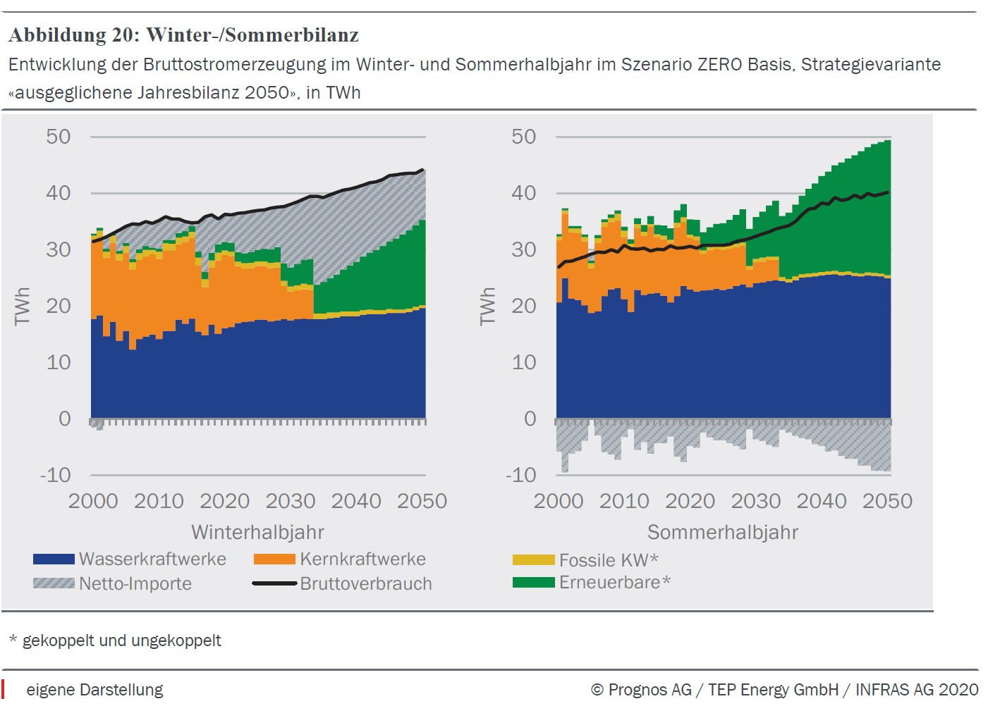

## Why is the government changing its Energy Strategy?

The Energy Strategy 2050+ is Switzerland’s most detailed plan to achieve net zero by 2050. However, the government has still made serious changes to this strategy. This article explains why the 2050+ plan had to change - difficulties securing winter electricity imports and expanding renewables - and what adjustments the government is now making to it.

See our companion piece,[The Swiss Energy Strategy 2050+: A First Step Towards a Greener Future](https://www.notion.so/The-Swiss-Energy-Strategy-2050-A-First-Step-Towards-a-Greener-Future-2b85cfface874930a71146d42c704e5b?pvs=21), for a brief overview of the old 2050+ strategy.

## Why were winter electricity imports a problem?

_Development of Swiss electricity production in the winter and summer half-years. Blue is hydro, orange is nuclear energy, yellow is fossil fuels, green is renewables, and grey is the net imports (or exports if below the x-axis)._

The first version of the 2050+ strategy relied heavily on hydro and solar, both of which underperform greatly during the winter. Even with high investments in these power sources, the Energy Perspectives report expected at least a 35% winter electricity production deficit around 2035 (the grey area in the graph) - which it hoped to meet through rising electricity imports from the EU. However, it is increasingly unlikely that these added imports can be secured.

Previously, the Swiss government promised that enough electricity imports would be available[10] as it planned to renew its electricity deals with the EU. Electricity deals guarantee that (groups of) countries will be able to import electricity from each other. Regrettably, a new electricity deal with the EU has yet to be agreed upon[8]. While the administration is continuing to negotiate, there is currently no guarantee that Switzerland can import large amounts of winter electricity from EU countries. Swissgrid, the organisation that manages Switzerland’s electricity network, has even sued the European Commission[6] over this issue.+

Under the old plan, this lack of imports might have risked devastating power shortages, which would cause injuries, loss of life and economic damage to Switzerland[7]. Apart from the moral implications, this is politically unpalatable since energy security is the highest priority for Swiss voters (as far as energy politics is concerned)[14]. Citizens also dislike being dependent on electricity imports from other countries[13], which the old plan heavily emphasised. This was shown by the referendum-approved climate and innovation law, which committed the government to reducing energy imports [16]. Furthermore, according to the Swiss Federal Electricity Commission (ElCom) and Swissgrid, the Swiss electricity system would not have been able to handle more than 10TWh of winter imports for long [17]. For these reasons, the government has decided to expand Switzerland’s internal electricity production heavily instead of massively increasing exports.

## Why was establishing renewables a problem?   

The government planned to expand the country’s wind, hydropower and solar installations [2]. However, their efforts faced several difficulties:

- The government initially overestimated the potential for Swiss **hydropower plants**[0]. Unfortunately, there are geographical limits on how many hydro installations ****can be built before new facilities start providing poor returns. To combat this, the old Energy strategy already approved projects in some previously protected nature reserves[1] and added subsidies for smaller, uneconomical power plants[9]. Despite these efforts, hydropower cannot possibly account for the entirety of the Swiss energy demand.
- While Swiss **wind energy** has potential, it faces serious opposition from local populations and environmental interest groups. Repeated lawsuits in many different courts, alongside an extremely long approval process, have made expanding wind power very difficult[18].
- **Alpine solar** is costly and faces similar opposition from environmental interest groups[19]. This previously forced the government to focus largely on **rooftop solar** installations, which are less effective during winter.
- According to Swissgrid, the **approval process** was too long to achieve meaningful change[17]. For example, the planned expansion of the Grimsel hydro dam has been held up for over 30 years[18]. +
- **Zoning laws** prevent, for example, solar panels from being installed on a farmer’s fields. Establishing wind and solar power in forests, residential areas, and agricultural centres has proved challenging.

## How is the plan changing?

While the government has yet to sponsor a new Energy Perspectives report, new laws give us a good impression of what the next energy strategy will look like. They have instigated the following changes[20]:

- The 2035 non-hydro renewables production target will be increased by 100%. Swiss green electricity will have to come online at an unprecedented rate.
- Winter electricity imports will be capped at 5TWh, down from 15TWh by 2050 and 9TWh by 2035 in the old plan.
- An additional 6 TWh of winter renewables will be constructed or procured. Approximately a third of this electricity production has to be highly reliable, which excludes rooftop solar and wind turbines.
- To meet this goal, the government can classify electricity generation projects as being “of national interest”, greatly streamlining the approval process. In all but exceptional cases, lawsuits will be handled by a single cantonal court.
- Network operators must prioritize buying electricity from local Swiss renewables.
- To combat a possible power shortage, an electricity reserve is being formed from (most likely) existing storage dams.
- Outside of special circumstances, new houses must be built with solar panels already installed.
- The government will offer better electricity sale prices or subsidies for new hydro, solar PV, wind and biomass installations.
- Zoning laws will be relaxed to allow for more wind and solar expansion (for example in agricultural or residential areas).

It is currently unclear which renewables Swiss suppliers will use to meet winter electricity demands. Possible candidates include alpine solar, biogas, hydrogen, geothermal, rooftop solar and wind turbines. The nation’s existing nuclear power plants may also have to remain operational for a longer amount of time.

## Conclusion

The old plan was plagued by large winter electricity production deficits and unreasonably long approval times for new projects. Fortunately, the government is planning to produce more electricity within Switzerland while streamlining the complicated approval process. It remains to be seen which renewable technologies will be used to meet these ambitious goals.